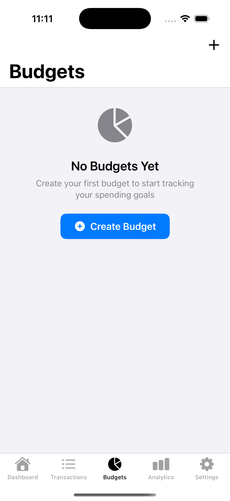

# 💰 Finance Tracker - iOS Personal Finance Management App

A comprehensive iOS personal finance management application built with SwiftUI, Core Data, and CloudKit. Track your income, expenses, budgets, and financial goals with a beautiful, intuitive interface.

## 📱 Screenshots

### Dashboard


Main dashboard showing balance, income, expenses, and budget overview

### Add Transaction


Add new income or expense transactions with categories

### Transactions List


View and manage all your financial transactions

### Budget Management


Set up and track spending budgets by category

### Settings & Features


Comprehensive settings with export, sync, and security options

### Siri Shortcuts (Demo)


Voice commands and quick actions with Siri integration

## ✨ Features

### 🎯 Core Features

- **Income & Expense Tracking** - Log and categorize all financial transactions
- **Budget Management** - Set spending limits and track progress
- **Financial Insights** - Visual charts and spending analysis
- **Category Management** - Organize transactions with custom categories
- **Search & Filter** - Find transactions quickly with advanced filtering

### 🔐 Security & Privacy

- **Biometric Authentication** - Face ID and Touch ID support
- **Data Encryption** - Secure storage of sensitive financial data
- **Privacy First** - No data collection or tracking
- **Local Storage** - All data stored locally with optional iCloud sync

### ☁️ Cloud Integration

- **iCloud Sync** - Seamless data synchronization across devices
- **CloudKit** - Robust cloud storage with conflict resolution
- **Offline Support** - Full functionality without internet connection
- **Automatic Backup** - Regular data backups to iCloud

### 🎨 Modern UI/UX

- **SwiftUI** - Native iOS design with smooth animations
- **Dark Mode** - Beautiful dark and light theme support
- **Accessibility** - Full VoiceOver and accessibility support
- **Haptic Feedback** - Tactile responses for better user experience

### 📊 Advanced Features

- **Data Export** - Export to PDF reports and CSV files
- **Receipt Scanning** - OCR-powered receipt scanning (Vision framework)
- **Siri Shortcuts** - Voice commands and quick actions
- **Home Screen Widgets** - Quick access to financial data
- **Push Notifications** - Budget alerts and spending reminders

## 🛠 Technical Architecture

### **Frontend**

- **SwiftUI** - Modern declarative UI framework
- **Combine** - Reactive programming for data flow
- **MVVM Architecture** - Clean separation of concerns

### **Backend & Data**

- **Core Data** - Local data persistence and management
- **CloudKit** - Cloud synchronization and storage
- **Keychain** - Secure storage for sensitive data

### **Services & Integration**

- **Vision Framework** - OCR for receipt scanning
- **Local Authentication** - Biometric authentication
- **PDFKit** - PDF report generation
- **Intents Framework** - Siri Shortcuts integration

### **Development Tools**

- **Xcode 15+** - Latest iOS development environment
- **iOS 16+** - Modern iOS features and APIs
- **Swift 5.9** - Latest Swift language features

## 🚀 Getting Started

### Prerequisites

- Xcode 15.0 or later
- iOS 16.0+ deployment target
- Apple Developer Account (for CloudKit and Siri features)
- macOS 13.0 or later

### Installation

1. **Clone the repository**

   ```bash
   git clone https://github.com/Sooryasanand/Finance-Tracker.git
   cd finance-tracker-ios
   ```

2. **Open in Xcode**

   ```bash
   open "Finance Tracker.xcodeproj"
   ```

3. **Configure CloudKit (Optional)**

   - Select your app target
   - Go to "Signing & Capabilities"
   - Add "CloudKit" capability
   - Configure your iCloud container

4. **Configure Siri Shortcuts (Optional)**

   - Add Siri capability in Xcode
   - Configure the required entitlements
   - Test Siri integration on a physical device

5. **Build and Run**
   - Select your target device or simulator
   - Press ⌘+R to build and run

### Configuration

#### CloudKit Setup

1. Enable CloudKit in your Apple Developer account
2. Create an iCloud container in Xcode
3. Configure the container identifier in the app

#### Siri Shortcuts Setup

1. Add Siri capability in Xcode
2. Configure the required entitlements
3. Test Siri integration on a physical device

## 📁 Project Structure

```
Finance Tracker/
├── Finance_TrackerApp.swift          # App entry point
├── Views/
│   ├── Screens/                      # Main app screens
│   │   ├── DashboardView.swift       # Main dashboard
│   │   ├── TransactionsView.swift    # Transaction list
│   │   ├── AddTransactionView.swift  # Add transaction
│   │   ├── BudgetView.swift          # Budget management
│   │   └── SettingsView.swift        # App settings
│   └── Components/                   # Reusable UI components
│       ├── TransactionRowView.swift
│       ├── BudgetProgressCard.swift
│       └── ReceiptScannerView.swift
├── ViewModels/                       # MVVM view models
│   ├── DashboardViewModel.swift
│   ├── TransactionsViewModel.swift
│   └── AddTransactionViewModel.swift
├── Models/                           # Data models
│   ├── Core Data entities
│   └── CoreDataExtensions.swift
├── Services/                         # Business logic services
│   ├── CoreDataStack.swift
│   ├── CloudKitSyncManager.swift
│   ├── BiometricAuthenticationService.swift
│   ├── ExportService.swift
│   └── SiriShortcutsService.swift
├── Extensions/                       # Swift extensions
├── Utilities/                        # Helper utilities
└── Resources/                        # App resources
```

## 🔧 Configuration

### Environment Variables

Create a `Config.plist` file for environment-specific settings:

```xml
<?xml version="1.0" encoding="UTF-8"?>
<!DOCTYPE plist PUBLIC "-//Apple//DTD PLIST 1.0//EN" "http://www.apple.com/DTDs/PropertyList-1.0.dtd">
<plist version="1.0">
<dict>
    <key>CloudKitContainerIdentifier</key>
    <string>iCloud.com.yourcompany.financetracker</string>
    <key>DefaultCurrency</key>
    <string>USD</string>
</dict>
</plist>
```

### Build Settings

- **Deployment Target**: iOS 16.0+
- **Swift Language Version**: Swift 5.9
- **Code Signing**: Automatic or manual with your team

## 🧪 Testing

### Unit Tests

```bash
# Run unit tests
xcodebuild test -scheme "Finance Tracker" -destination 'platform=iOS Simulator,name=iPhone 15'
```

### UI Tests

```bash
# Run UI tests
xcodebuild test -scheme "Finance Tracker" -destination 'platform=iOS Simulator,name=iPhone 15' -only-testing:FinanceTrackerUITests
```

## 📦 Deployment

### App Store Deployment

1. **Archive the app** in Xcode
2. **Upload to App Store Connect**
3. **Configure app metadata** and screenshots
4. **Submit for review**

### TestFlight Distribution

1. **Archive and upload** to App Store Connect
2. **Create TestFlight build**
3. **Invite testers** or use public beta

## 🤝 Contributing

We welcome contributions! Please follow these steps:

1. **Fork the repository**
2. **Create a feature branch** (`git checkout -b feature/amazing-feature`)
3. **Commit your changes** (`git commit -m 'Add amazing feature'`)
4. **Push to the branch** (`git push origin feature/amazing-feature`)
5. **Open a Pull Request**

### Development Guidelines

- Follow Swift style guidelines
- Write unit tests for new features
- Update documentation for API changes
- Ensure accessibility compliance

## 📄 License

This project is licensed under the MIT License - see the [LICENSE](LICENSE) file for details.

## 🙏 Acknowledgments

- **Apple** for SwiftUI, Core Data, and CloudKit
- **SwiftUI Community** for inspiration and best practices
- **Open Source Contributors** for various libraries and tools

## 🔄 Version History

- **v1.0.0** - Initial release with core features
- **v1.1.0** - Added CloudKit sync and Siri Shortcuts
- **v1.2.0** - Enhanced UI and performance improvements

---

**Made with ❤️ using SwiftUI and Core Data**

This app is designed to help you take control of your finances with a beautiful, secure, and intuitive interface.
